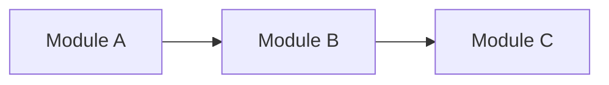
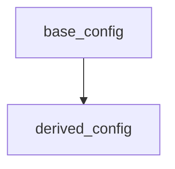
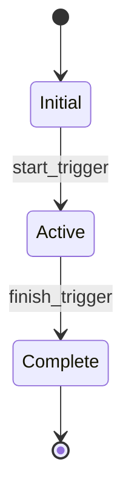

# Technical Requirement Specification

<!-- TECH-SPEC output template for the tech-spec-generator agent.
     Derived from the 7C contract structure in system design Section 10.
     No Chinese source prompt exists for this spec -- structure is based on
     Section 10 subsections: 10.1 state machines, 10.2 event bus,
     10.3 rule priorities, 10.4 formula pseudo-code, 10.5 error codes,
     10.6 client/server responsibility.
     Output language follows the project's LANGUAGE config; structure/field names stay in English.
-->

## A. Input Confirmation and Scope

<!-- Source: System design file paths, data schema, and balance documentation.
     This spec aggregates 7C contracts (Section 10) across ALL systems.
     List every system ID whose tech contracts are covered. -->

- **Stage 2 path:**
- **Stage 2 version:**
- **Stage 3A reference:**
- **Stage 3B reference (if applicable):**
- **Systems covered:**

| System ID | System Name | Section 10 Available | Coverage |
|-----------|-------------|----------------------|----------|
| | | Yes / No | Full / Partial |

- **Module coverage summary:**
- **Out-of-scope modules and reasons:**

---

## B. Module Architecture

<!-- Source: Aggregate Section 10 across all systems to identify module boundaries.
     Each system typically maps to one or more modules.
     Cross-module dependencies must be explicit. -->

### Module Responsibility Table

| Module ID | Module Name | Source System(s) | Primary Responsibility | Dependencies |
|-----------|-------------|------------------|------------------------|--------------|
| | | | | |

### Cross-Module Dependency Graph



### Module Boundary Rules

- **Ownership:** Each capability belongs to exactly one module
- **Communication:** Modules communicate via event bus (Section E), not direct calls
- **Data:** Each module owns its config tables; shared data accessed via read-only APIs

---

## C. Config Loading Architecture

<!-- Source: Section 8 tech anchors + Stage 3A data schema (tables.md).
     Map which modules load which config tables.
     Include loading timing and hot-update capabilities. -->

### Module-to-Table Mapping

| Module ID | Config Tables | Loading Timing | Hot-Update | Dependencies |
|-----------|---------------|----------------|------------|--------------|
| | | startup / lazy / on-demand | Yes / No | |

### Loading Timing Categories

- **Startup:** Loaded before game loop begins; blocking
- **Lazy:** Loaded on first access; non-blocking
- **On-demand:** Loaded per explicit request; non-blocking

### Config Dependency Graph



---

## D. State Machine Definitions

<!-- Source: Section 10.1 from each system design file.
     Aggregate all state machines across all systems.
     Explicitly mark cross-system transitions. -->

### State Machine: [Machine Name]

**Source system:** [System ID]
**Scope:** [Module ID]

| State | Entry Condition | Exit Transitions | Guard | Action |
|-------|-----------------|------------------|-------|--------|
| | | | | |



**Cross-system transitions:**

| From State (System) | To State (System) | Trigger | Payload |
|---------------------|-------------------|---------|---------|
| | | | |

<!-- Repeat for each state machine defined in Section 10.1 across all systems. -->

---

## E. Event Bus Contracts

<!-- Source: Section 10.2 from each system design file.
     Create a unified event catalog spanning all systems.
     Every event must have a defined publisher, subscribers, and payload schema. -->

### Event Catalog

| Event Name | Publisher (System) | Subscribers (Systems) | Payload Schema | Timing Constraints |
|------------|--------------------|-----------------------|----------------|-------------------|
| | | | | |

### Event Payload Schemas

**[Event Name]:**

```
{
  // field: type -- description
}
```

### Event Ordering and Guarantees

- **Delivery guarantee:** (at-most-once / at-least-once / exactly-once)
- **Ordering:** (per-publisher FIFO / global ordering / unordered)
- **Timing:** (sync / async / deferred)

<!-- Repeat payload schema for each event with complex payloads. -->

---

## F. Formula and Algorithm Specs

<!-- Source: Section 10.4 from each system design file.
     Aggregate pseudo-code formulas across all systems.
     Reference balance layer parameters where applicable. -->

| Formula ID | System | Input Parameters | Output | Balance Layer Reference |
|------------|--------|------------------|--------|------------------------|
| | | | | |

### Formula: [Formula ID]

**System:** [System ID]
**Purpose:**

```pseudo
// Pseudo-code from Section 10.4
function formulaName(params):
    // implementation
    return result
```

**Parameter sources:**

| Parameter | Source Table | Field | Update Frequency |
|-----------|-------------|-------|------------------|
| | | | |

<!-- Repeat for each formula defined in Section 10.4 across all systems. -->

---

## G. Error Code Catalog

<!-- Source: Section 10.5 from each system design file.
     Create a unified error code table.
     Error codes must be unique across all systems. -->

| Error Code | System | Category | Severity | User Message | Recovery Strategy |
|------------|--------|----------|----------|--------------|-------------------|
| | | logic / data / network / state | critical / warning / info | | |

### Error Categories

- **Logic errors:** Invalid operations, rule violations
- **Data errors:** Missing config, corrupt data, parse failures
- **Network errors:** Timeout, connection loss, sync failures
- **State errors:** Invalid transitions, stale state, race conditions

### Recovery Strategies

| Strategy | Description | When to Use |
|----------|-------------|-------------|
| retry | Automatic retry with backoff | Transient network errors |
| fallback | Use cached/default value | Config loading failures |
| block | Prevent action, show error | Logic violations |
| reset | Reset to known good state | Corrupt state detection |

---

## H. Client/Server Responsibility Matrix

<!-- Source: Section 10.6 from each system design file.
     Define per-module client/server split.
     Include data flow direction and sync strategy. -->

| Operation | Module | Client Responsibility | Server Responsibility | Data Flow Direction | Sync Strategy |
|-----------|--------|-----------------------|-----------------------|---------------------|---------------|
| | | | | C->S / S->C / bidirectional | realtime / batch / on-demand |

### Sync Strategy Definitions

- **Realtime:** Immediate sync on every state change
- **Batch:** Periodic sync at defined intervals or checkpoints
- **On-demand:** Sync only on explicit request (e.g., save, purchase)

### Offline Behavior

| Module | Offline Capability | Data Cached | Sync-on-Reconnect Strategy |
|--------|--------------------|-----------|-----------------------------|
| | Full / Partial / None | | |

---

## I. Exception Handling Scenarios

<!-- Source: Section 10 exceptions + data schema constraints from Stage 3A.
     Define per-module exception scenarios with detection and fallback strategies. -->

| Scenario | Module | Trigger | Detection Method | Fallback Strategy | User Communication |
|----------|--------|---------|------------------|-------------------|--------------------|
| | | | | | |

### Exception Handling Defaults by Layer

| Layer | Default Strategy | Example |
|-------|------------------|---------|
| core_config | block_load | Missing critical config prevents game start |
| constants | use_default | Missing constant uses hardcoded fallback |
| progress | set_null | Corrupt progress field set to null, rebuilt on next save |

<!-- Repeat scenarios for each module. -->

---

## J. Data Config Dependencies

<!-- Source: Stage 3A data schema (tables.md) + FK dependency graph.
     Map which modules load which config tables.
     Loading order follows topological sort of the FK dependency graph. -->

### Table-to-Module Mapping

| Config Table | Owner Module | Consumer Modules | Loading Order | Hot-Update Constraint |
|--------------|-------------|------------------|---------------|----------------------|
| | | | (topological rank) | Safe / Requires restart |

### Topological Loading Order

```
1. [independent tables -- no FK dependencies]
2. [tables depending on tier 1]
3. [tables depending on tier 2]
...
```

### Hot-Update Constraints

| Constraint Type | Affected Tables | Reason |
|-----------------|-----------------|--------|
| No hot-update | | Runtime references cached |
| Safe hot-update | | Values read per-access |
| Restart required | | Schema-level dependencies |

---

## K. Blockers and Open Questions

<!-- List any issues that block tech implementation or require resolution.
     Separate blocking issues from items that can proceed in parallel. -->

### Blockers (Block Implementation)

| ID | Description | Blocking | Owner | Status |
|----|-------------|----------|-------|--------|
| | | [which modules/systems] | | Open |

### Open Questions (Can Proceed in Parallel)

| ID | Question | Impact | Proposed Resolution |
|----|----------|--------|---------------------|
| | | | |

---

*Spec type: tech | Generated by: tech-spec-generator agent*
*Source: Derived from 7C contract structure (system design Section 10)*
