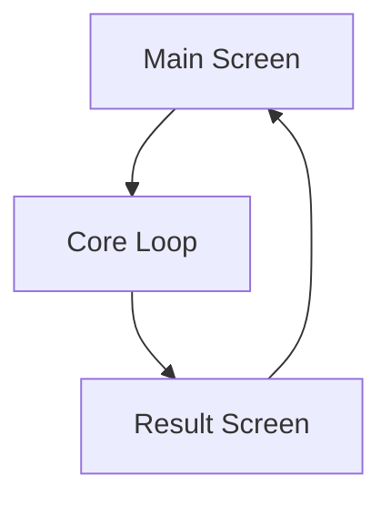

# UI/UX Requirement Specification

<!-- UI-SPEC output template for the ui-spec-generator agent.
     Adapted from game-implement-process/stage4/系统提示词_UIUX需求文档.md
     All section headings and column names in English.
     Genre-agnostic: page lists and interaction flows are configurable per game.
     Output language follows the project's LANGUAGE config; structure/field names stay in English.
-->

## A. Input Confirmation and Scope

<!-- Source: System design file paths and version info from .gf/stages/02-system-design/.
     List every system ID whose UI/UX requirements are covered in this spec.
     Cross-reference the id-registry.json for valid system IDs. -->

- **Stage 2 path:**
- **Stage 2 version:**
- **Stage 3A reference (if applicable):**
- **Art spec reference (if applicable):**
- **Systems covered:**

| System ID | System Name | Coverage |
|-----------|-------------|----------|
| | | Full / Partial |

- **Out-of-scope pages and reasons:**

---

## B. Experience Goals and Interaction Principles

<!-- Source: Stage 2 concept document and system design overviews.
     Define the core UX targets and interaction timing rules.
     Generalize timing references to be genre-appropriate. -->

### Core Experience Targets

| Timeframe | Experience Goal |
|-----------|-----------------|
| First 10 seconds | |
| First 1 minute | |
| First 3 minutes | |
| First session | |

### Interaction Principles

- **Fast feedback:** (response time targets)
- **Minimal interruption:** (when to avoid popups/overlays)
- **Reversibility:** (undo/back expectations)
- **Mis-tap prevention:** (touch target sizing, confirmation rules)

### Weekly Engagement Rhythm

- Experience pacing principles aligned with content rhythm:

---

## C. Page Architecture and Navigation

<!-- Source: System entry points and navigation flows from each system design.
     Page list is flexible based on systems -- do NOT hardcode a fixed page set.
     Include a Mermaid navigation flow diagram. -->

### Page Inventory

| Page ID | Page Name | Parent System | Entry Condition | Exit Condition | Priority |
|---------|-----------|---------------|-----------------|----------------|----------|
| | | | | | P0/P1/P2 |

### Navigation Flow



---

## D. Key Page Specs

<!-- Source: System designs for page layout, component needs, and data bindings.
     Use the fixed template below for EACH key page.
     The page list is flexible -- include all pages from Section C marked P0 or P1. -->

### Page: [Page ID] -- [Page Name]

- **Page goal:**
- **Entry source(s):**
- **Exit destination(s):**

**Layout Structure:**

| Zone | Content | Components |
|------|---------|------------|
| Top | | |
| Center | | |
| Bottom | | |
| Overlay | | |

**Core Component List:**

| Component ID | Component Name | States | Interaction |
|--------------|----------------|--------|-------------|
| | | | |

**Data Bindings:**

| Data Field | Source System | Source Table | Update Trigger |
|------------|--------------|-------------|----------------|
| | | | |

**Exception States:**

| State | Trigger | Display | Recovery Action |
|-------|---------|---------|-----------------|
| Empty state | | | |
| Error state | | | |
| Loading state | | | |

<!-- Repeat this template for each key page. -->

---

## E. Core Interaction Flows

<!-- Source: Core gameplay loops and system interactions from system designs.
     The flow list is flexible -- derive from the game's actual systems.
     Do NOT hardcode a fixed list of 7 flows. Include as many as the systems require. -->

### Flow: [Flow Name]

**Systems involved:** [System IDs]

| Step | User Action | System Feedback | Transition Condition | Failure Fallback |
|------|-------------|-----------------|----------------------|------------------|
| 1 | | | | |
| 2 | | | | |
| 3 | | | | |

<!-- Repeat for each core interaction flow. -->

---

## F. New User Guidance Specs

<!-- Source: New user onboarding design from system designs.
     Define both strong (forced) and weak (optional) guidance steps.
     Include completion triggers and skip rules. -->

### Guidance Steps

| Step ID | Page | Trigger Condition | Guidance Action | Release Condition | Skip Rule |
|---------|------|-------------------|-----------------|-------------------|-----------|
| | | | | | |

### Guidance Boundaries

- **Strong guidance** (forced, blocks progress): Steps [list]
- **Weak guidance** (optional, can dismiss): Steps [list]
- **First-failure teaching fallback:**

---

## G. Ad and Payment Interaction Specs

<!-- Source: Monetization touchpoints from system designs.
     Genre-aware note: Skip this section entirely for premium games without ads/IAP.
     Include only the monetization mechanisms relevant to the game's model. -->

<!-- If the game has no ads or IAP, replace this section with:
     "Not applicable -- this game uses a premium (paid) model without ads or IAP." -->

### Rewarded Ad Flows

| Entry Point | Page | Button Style | Copy Rule | Reward Promise | Failure Fallback |
|-------------|------|--------------|-----------|----------------|------------------|
| | | | | | |

### Interstitial Timing

| Trigger Node | Frequency Control | Prompt Strategy |
|--------------|-------------------|-----------------|
| | | |

### Ad Failure Handling

- **Reward promise handling:** (how to honor promised reward if ad fails)
- **Network error fallback:**

### IAP Purchase Flows

| Product Type | Entry Point | Purchase Flow | Failure/Cancel Recovery |
|--------------|-------------|---------------|------------------------|
| | | | |

### Post-Purchase Page Changes

- **Ad removal purchase:** (which UI elements change/hide)
- **Content unlock purchase:** (which pages become accessible)

---

## H. Component Specs and State Machines

<!-- Source: UI component patterns from system designs.
     Every reusable component needs a state machine definition.
     Component list is flexible -- include all components used across pages. -->

### Component Table

| Component ID | Component Name | States | Default State | Transitions | Used On Pages |
|--------------|----------------|--------|---------------|-------------|---------------|
| | | | | | |

### State Machine Diagrams

**[Component Name]:**

```mermaid
stateDiagram-v2
    %% Replace with actual component states
    [*] --> Default
    Default --> Active: trigger
    Active --> Default: reset
```

<!-- Repeat for each component with complex state behavior. -->

---

## I. Usability and Adaptation

<!-- Source: Platform requirements and accessibility standards.
     These are generally consistent across game types. -->

- **Resolution support:**
  - Target resolutions:
  - Aspect ratio handling:
  - Orientation: (portrait / landscape / both)
- **Single-hand reachability zones:**
  - Primary action zone:
  - Secondary action zone:
  - Avoid zone:
- **Mis-tap prevention:**
  - Minimum touch target size:
  - Confirmation thresholds:
- **Text readability:**
  - Minimum font size:
  - Contrast ratio minimum:
- **Accessibility basics:**
  - Color-blind safe palette consideration:
  - Screen reader hints (if applicable):
- **Weak network and low-end device degradation:**
  - Loading state strategy:
  - Animation reduction:
  - Asset quality scaling:

---

## J. Analytics Events (UI Side)

<!-- Source: Key user actions and conversion funnels from system designs.
     Focus on UI-triggered events. Backend events belong in TECH-SPEC.md. -->

| Event Name | Trigger | Page | Payload | Priority |
|------------|---------|------|---------|----------|
| page_view | Page opened | [Page ID] | page_id, source | P0 |
| button_click | Core button tapped | [Page ID] | button_id, context | P0 |
| ad_impression | Ad entry shown | [Page ID] | ad_type, placement | P0 |
| ad_click | Ad entry tapped | [Page ID] | ad_type, placement | P0 |
| ad_return | Return from ad | [Page ID] | ad_type, result | P0 |
| iap_impression | IAP entry shown | [Page ID] | product_id | P0 |
| iap_click | IAP entry tapped | [Page ID] | product_id | P0 |
| iap_result | Purchase completed/failed | [Page ID] | product_id, result | P0 |
| churn_signal | Key drop-off action | [Page ID] | action, context | P1 |

<!-- Add game-specific events as needed. -->

---

## K. Dev Handoff Checklist

<!-- Source: Aggregated dependencies from all page specs and interaction flows.
     Organize by dependency type for the development team. -->

### Frontend Implementation Dependencies

| Dependency | Required By (Pages) | Status |
|------------|---------------------|--------|
| | | |

### Art Asset Dependencies

| Asset | Required By (Pages) | ART-SPEC Reference |
|-------|---------------------|---------------------|
| | | |

### Data Config Dependencies

| Config Table | Required By (Pages) | Stage 3A Reference |
|--------------|---------------------|---------------------|
| | | |

### SDK Dependencies

| SDK | Purpose | Required By (Pages) |
|-----|---------|---------------------|
| | | |

---

## L. Acceptance and Test Cases

<!-- Source: Derive from page specs and interaction flows.
     Cover page reachability, critical paths, error states, and edge cases. -->

### Page Reachability Verification

| Page ID | Entry Path | Expected Result | Status |
|---------|------------|-----------------|--------|
| | | Page loads correctly | |

### Critical Path Testing

| Flow Name | Steps | Expected Outcome | Status |
|-----------|-------|-------------------|--------|
| | | Completes without error | |

### Error State Testing

| Page ID | Error Scenario | Expected Display | Recovery Action | Status |
|---------|----------------|------------------|-----------------|--------|
| | | | | |

### Edge Case Coverage

| Scenario | Pages Affected | Expected Behavior | Status |
|----------|----------------|-------------------|--------|
| Network loss mid-flow | | | |
| Background/foreground switch | | | |
| Insufficient resources | | | |
| Session timeout | | | |

---

## M. Blockers and Open Questions

<!-- List any issues that block UI/UX development or require resolution.
     Separate blocking issues from items that can proceed in parallel. -->

### Blockers (Block Development)

| ID | Description | Blocking | Owner | Status |
|----|-------------|----------|-------|--------|
| | | [which pages/flows] | | Open |

### Open Questions (Can Proceed in Parallel)

| ID | Question | Impact | Proposed Resolution |
|----|----------|--------|---------------------|
| | | | |

---

*Spec type: ui_ux | Generated by: ui-spec-generator agent*
*Source: Adapted from game-implement-process/stage4/系统提示词_UIUX需求文档.md*
